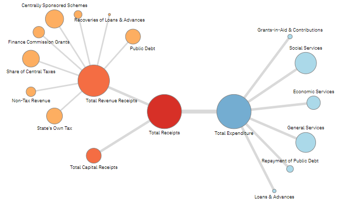
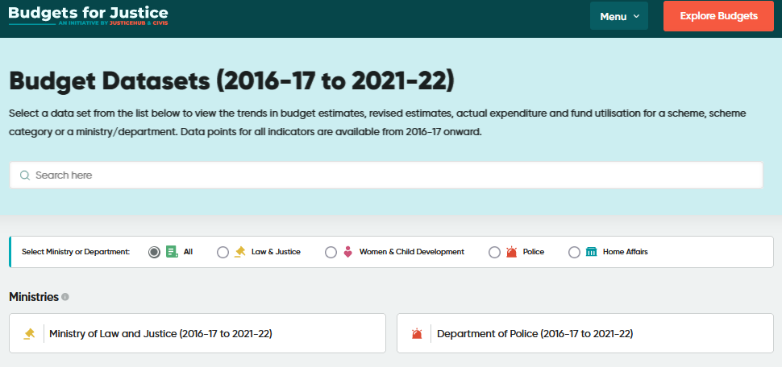
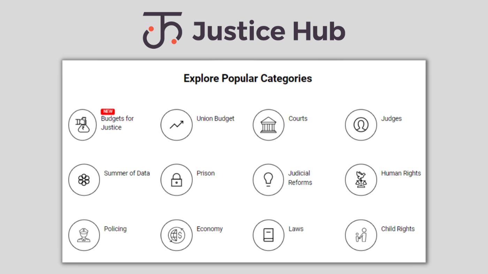
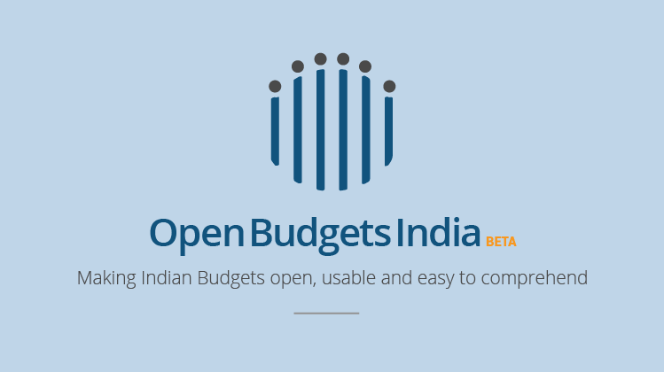

## Datasets and Tools

:::{layout-ncol=2}

::: callout-note

### Assam Budget Explorer

Explore and analyse the 2022-23 budget for Assam
[{fig-alt="Link to Assam Budget Explorer"}](https://assam2022.openbudgetsindia.org/en/){target="_blank"}
:::

::: callout-note
### Budgets for Justice

Explore patterns in budget allocation for law and justice related schemes in Assam. 

</n>

[{fig-alt="Link to Budgets for Justice platform"}](https://budgets.justicehub.in/state/assam){target="_blank"}
:::

::: callout-note

### Justice Hub

Download law and justice related datasets.

[{fig-alt="Link to Justice Hub"}](https://justicehub.in){target="_blank"}
:::

::: callout-note

### Open Budgets India

Download state budget datasets.

[{fig-alt="Link to Open Budgets India"}](https://openbudgetsindia.org/){target="_blank"}
:::

:::
